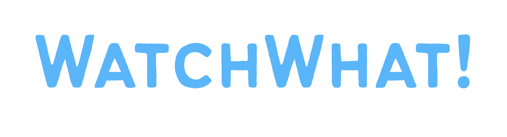
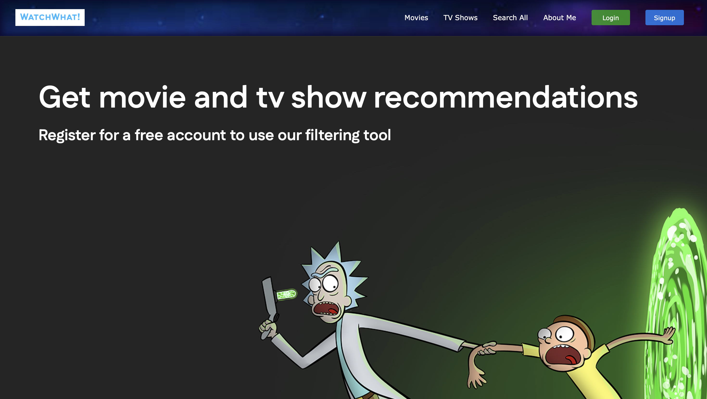
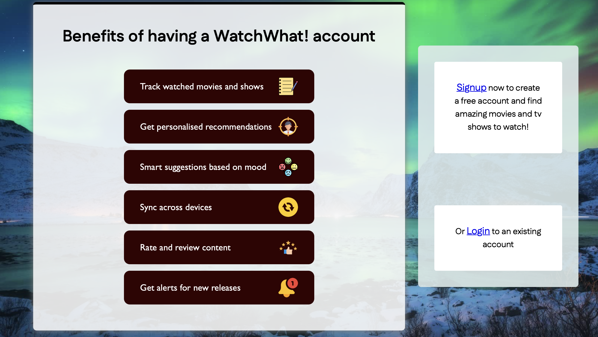

[![Vansh Rugnate][github-badge]][github-url]
[![LinkedIn][linkedin-badge]][linkedin-url]

<!-- PROJECT LOGO -->

  

  <h3 align="center">Movie & TV Show Recommender</h3>

<!-- ABOUT THE PROJECT -->
## About The Project

WatchWhat! is a personal project web application designed to help users <b>discover movies and TV shows</b> when they don’t know what to watch. Instead of endlessly scrolling through streaming platforms, users can apply <b>filters</b> and instantly receive a <b>randomised recommendation</b> that matches their preferences. The app fetches data using the <b>TMDb API</b>, ensuring up-to-date information on movies and TV shows.

The app allows users to refine their search using filters such as genre, release year, runtime, and original language, making it easier to find something that fits their mood. Once filters are applied, the application generates a random movie or TV show suggestion from the matching results, <b>encouraging exploration</b> and helping users <b>discover content</b> they may not have considered before.

This project was built to solve a common problem: decision fatigue when choosing what to watch. By combining filtering with randomised recommendations, <b>WatchWhat! makes the process of finding entertainment faster, simpler, and more fun.</b>

### Built With

* [![Python][Python-badge]][Python-url]
* [![Flask][Flask-badge]][Flask-url]
* [![HTML5][HTML-badge]][HTML-url]
* [![JavaScript][JS-badge]][JS-url]
* [![CSS3][CSS-badge]][CSS-url]
* [![SQLite][SQLite-badge]][SQLite-url]
* [![SQLAlchemy][SQLAlchemy-badge]][SQLAlchemy-url]
* [![Jinja2][Jinja-badge]][Jinja-url]

## Next Steps

These are some features I will add:
<ol>
  <li><b>Already Watched List</b> - Users can add or remove movies and TV shows they’ve already watched. Items in this list will be excluded from future recommendations to avoid duplicates.</li>
  <li><b>Watch Later List</b> - Users can save content they want to watch later and manage the list as needed.</li>
  <li><b>Accessibility Options</b> - features to improve usability:
    <ul>
      Adjustable font size
    </ul>
    <ul>
      Dark mode / light mode toggle
    </ul>
    <ul>
      Language selection
    </ul>
  </li>
</ol>

## Screenshots

The homepage features a sleek navigation bar that is consistent with all pages.

-
-
-

Some features that are included with a free account.

<!-- MARKDOWN LINKS & IMAGES -->
<!-- https://www.markdownguide.org/basic-syntax/#reference-style-links -->
[github-badge]: https://img.shields.io/badge/-Vansh%20Rugnate-black?style=for-the-badge&logo=linkedin&colorB=282928
[github-url]: https://github.com/vansh-rugnate
[linkedin-badge]: https://img.shields.io/badge/-LinkedIn-black.svg?style=for-the-badge&logo=linkedin&colorB=282928
[linkedin-url]: https://www.linkedin.com/in/vansh-rugnate
[Python-badge]: https://img.shields.io/badge/Python-3776AB?style=for-the-badge&logo=python&logoColor=white
[Python-url]: https://www.python.org/
[Flask-badge]: https://img.shields.io/badge/Flask-000000?style=for-the-badge&logo=flask&logoColor=white
[Flask-url]: https://flask.palletsprojects.com/
[HTML-badge]: https://img.shields.io/badge/HTML5-E34F26?style=for-the-badge&logo=html5&logoColor=white
[HTML-url]: https://developer.mozilla.org/en-US/docs/Web/HTML
[JS-badge]: https://img.shields.io/badge/JavaScript-F7DF1E?style=for-the-badge&logo=javascript&logoColor=black
[JS-url]: https://developer.mozilla.org/en-US/docs/Web/JavaScript
[CSS-badge]: https://img.shields.io/badge/CSS3-1572B6?style=for-the-badge&logo=css3&logoColor=white
[CSS-url]: https://developer.mozilla.org/en-US/docs/Web/CSS
[SQLite-badge]: https://img.shields.io/badge/SQLite-003B57?style=for-the-badge&logo=sqlite&logoColor=white
[SQLite-url]: https://www.sqlite.org/
[SQLAlchemy-badge]: https://img.shields.io/badge/SQLAlchemy-D71F00?style=for-the-badge
[SQLAlchemy-url]: https://www.sqlalchemy.org/
[Jinja-badge]: https://img.shields.io/badge/Jinja2-B41717?style=for-the-badge
[Jinja-url]: https://jinja.palletsprojects.com/
